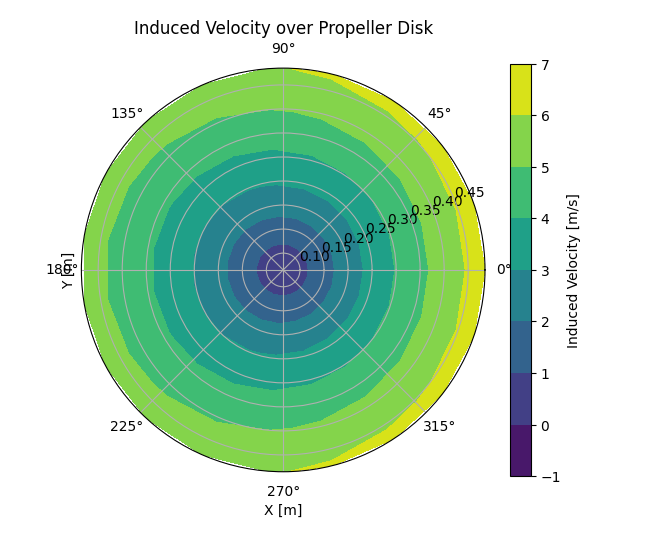
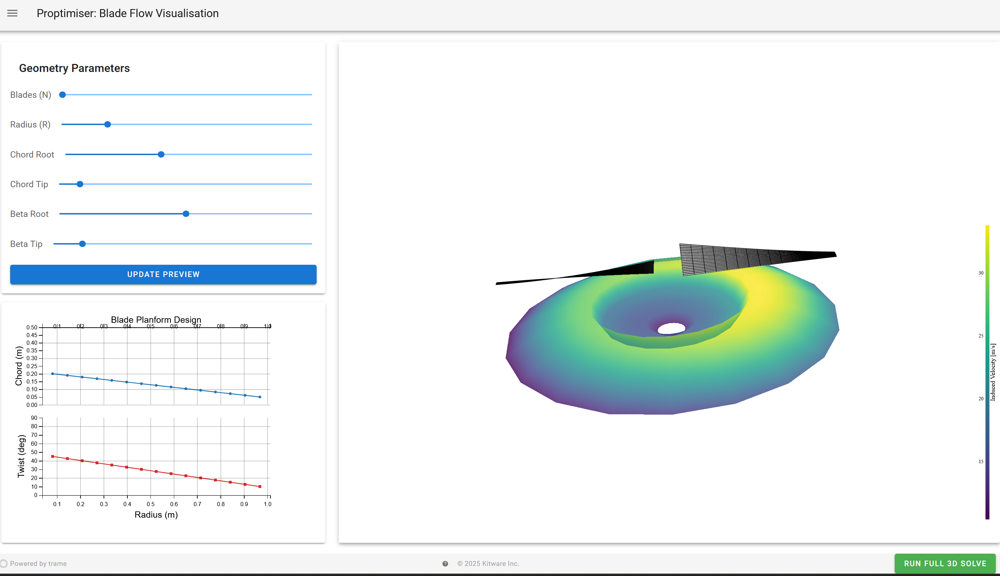

# 1 A BEMT Propeller Optimisation Tool

Implements [A Propeller Model for General Forward Flight Conditions](https://doi.org/10.1108/IJIUS-06-2015-0007) alongside numerical data on airfoils to find the most efficient propeller for given flight conditions.

This solver utilises [JAX](https://docs.jax.dev/en/latest/index.html) auto-differentiation to speed up the process of minimising the power consumption of the propeller, allowing hardware acceleration.

# 1 Development

See the [Proptimiser To-Do](Proptimiser%20To-Do.md) for a list of planned (and brainstormed) features.

# 2 Overview

## BEMT Model

First, a general model of the inflow is established for the disc of the initial guess for the propeller, utilising [@khanPropellerModelGeneral2015] to model arbitrary forward flight conditions.

The induced flow field is optimised using *Broyden* from [@JAXoptJAXopt08] a relatively efficient newton-like solver.



From this induced velocity field, the performance characteristics of the propeller can be established. These performance characteristics are than parsed to the optimiser.

## Optimiser

# 3 Using Proptimiser

## Installation (Windows)

Once inside the repository, type 

```
python -m venv venv
```

Once it's done installing you should have a venv folder in the repo. Make sure you're using cmd and not powershell, then to activate the virtual environment type

```
.venv\Scripts\activate.bat
```

and then once you're in your virtual environment

```
pip install -r requirements.txt
```

afterwards you should be able to call 

```
python bladevis.py
```

It'll spit out a web-view for 3D vis and blade shape.

## Using Proptimiser

Proptimiser can be accessed through a web interface via [trame](trame.net), and visualises data through a combination of [matplotlib]() and [pyvista]( https://pyvista.org/).

Currently the **propvis.py** file can be used to visualise the propeller, and work is being done to finalise the optimiser.



# 4 Limitations

- Assumed wake effects are minimal compared to axial flow.
- Actuator Disk Theory is used as an optimality metric.
- Suitable initial guess is required for propeller.

# Bibliography

[1]

S. Mancini, K. Boorsma, G. Schepers, and F. Savenije, “A comparison of dynamic inflow models for the blade element momentum method,” _Wind Energ. Sci._, vol. 8, no. 2, pp. 193–210, Feb. 2023, doi: [10.5194/wes-8-193-2023](https://doi.org/10.5194/wes-8-193-2023).

[2]

J. V. R. Prasad, Y.-B. Kong, and D. Peters, “ANALYTICAL METHODS FOR MODELING INFLOW DYNAMICS OF A COAXIAL ROTOR SYSTEM”.

[3]

P. Yu, J. Peng, J. Bai, X. Han, and X. Song, “Aeroacoustic and aerodynamic optimization of propeller blades,” _Chinese Journal of Aeronautics_, vol. 33, no. 3, pp. 826–839, Mar. 2020, doi: [10.1016/j.cja.2019.11.005](https://doi.org/10.1016/j.cja.2019.11.005).

[4]

W. Zhong, T. Wang, W. Z. Shen, and W. J. Zhu, “A function improving tip loss correction of blade-element momentum theory for wind turbines,” _International Journal of Sustainable Energy_, vol. 43, no. 1, p. 2352794, Dec. 2024, doi: [10.1080/14786451.2024.2352794](https://doi.org/10.1080/14786451.2024.2352794).

[5]

“Optax — Optax documentation.” Accessed: Dec. 14, 2025. [Online]. Available: [https://optax.readthedocs.io/en/latest/#](https://optax.readthedocs.io/en/latest/#)

[6]

W. Khan and M. Nahon, “A propeller model for general forward flight conditions,” _International Journal of Intelligent Unmanned Systems_, vol. 3, no. 2/3, pp. 72–92, May 2015, doi: [10.1108/IJIUS-06-2015-0007](https://doi.org/10.1108/IJIUS-06-2015-0007).

[7]

D. M. Pitt and D. A. Peters, “THEORETICAL PREDICTION OF DYNAMIC-INFLOW DERIVATIVES.,” _Vertica_, vol. 5, no. 1, pp. 21–34, 1981.
